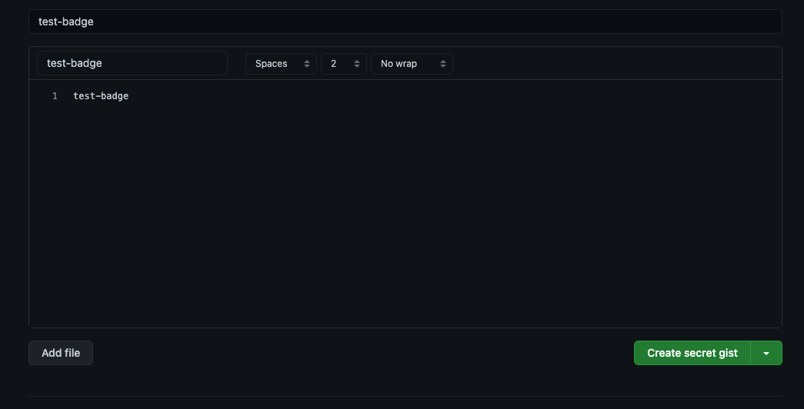
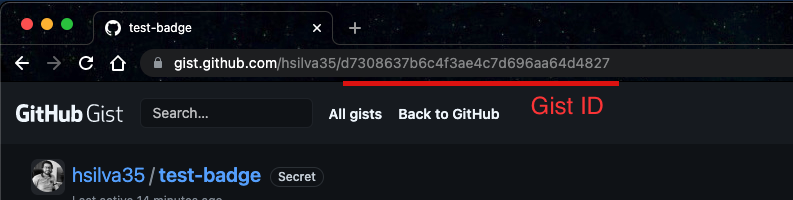
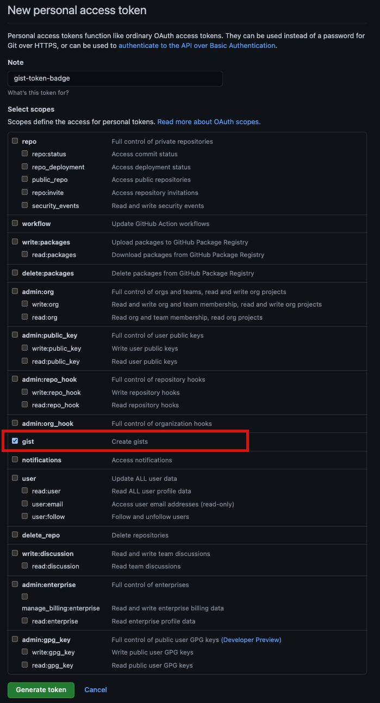

[](https://github.com/hsilva35/test/actions/workflows/node.js.yml)


## Brief documentation of How create a badge without third parties.

The first step we must perform is the creation of a `gist` that will be where we are going to save the summary that we export from the execution of the GitHub action.


To do this we go to https://gist.github.com/ and create the gist for the repository.


We are going to copy the code of the generated gist, which we will use as the `GIST_ID`.




The second step of the configuration will be to create a token that has the gist scope, for this we enter the page https://github.com/settings/tokens, define a name and select the gist scope.


We copy the token and we go to the settings of the repository in which we want to create the badge.


Go to Setting > secrets and click on 'New Repository Secret'.
Define the name of the environment variable. e.g.: GIST_TOKEN and paste the previously copied value.
We will also create a secret for the GIST_ID.

Now we will configure the action, for this we will have a workflow like the one below.

```
name: Node.js CI

on:
  push:
    branches: [ main ]
  pull_request:
    branches: [ main ]

jobs:
  ci:

    runs-on: ubuntu-latest

    steps:
    - uses: actions/checkout@v2
    - name: Use Node.js
      uses: actions/setup-node@v1
      with:
        node-version: '14.x'

    - name: Install dependencies
      run: npm install

    - name: Get Coverage for badge
      run: |
        SUMMARY="$(npm run test:coverage | grep Lines)"
        TOKENS=($SUMMARY)
        # set env variable with value of coverage
        echo "COVERAGE=$(echo ${TOKENS[2]})" >> $GITHUB_ENV 
        REF=${{ github.ref }}
        echo "github.ref: $REF"
        IFS='/' read -ra PATHS <<< "$REF"
        BRANCH_NAME="${PATHS[1]}_${PATHS[2]}"
        echo $BRANCH_NAME
        echo "BRANCH=$(echo ${BRANCH_NAME})" >> $GITHUB_ENV
    - name: Create the Badge
      uses: schneegans/dynamic-badges-action@v1.0.0
      with:
        auth: ${{ secrets.GIST_SECRET }}
        gistID: ${{ secrets.GIST_ID }}
        filename: test__${{ env.BRANCH }}.json # Filename created in gist
        label: Test Coverage 
        message: ${{ env.COVERAGE }}
        color: orange # Can be calculated using the value of env.COVERAGE
        namedLogo: jest
    - name: 'Comment PR'
      uses: actions/github-script@0.3.0
      if: github.event_name == 'pull_request'
      with:
        github-token: ${{ secrets.GITHUB_TOKEN }}
        script: |
          const { issue: { number: issue_number }, repo: { owner, repo }  } = context;
          github.issues.createComment({ issue_number, owner, repo, body: 'Test of comment' });

```

In the step `Get Coverage for badge`, we can have the command `npm run test:coverage` if we have it previously configured in the package.json file, in case we cannot modify that file we can change it by the command `jest --coverage --coverageReporters='text-summary'`.

It is important to clarify that the `coverageReporters` must be `text-summary` since from here the information that we are going to require for the construction of the badge will be extracted.

## References
- https://itnext.io/github-actions-code-coverage-without-third-parties-f1299747064d
- https://dev.to/thejaredwilcurt/coverage-badge-with-github-actions-finally-59fa
- https://github.com/marketplace/actions/comment-pull-request